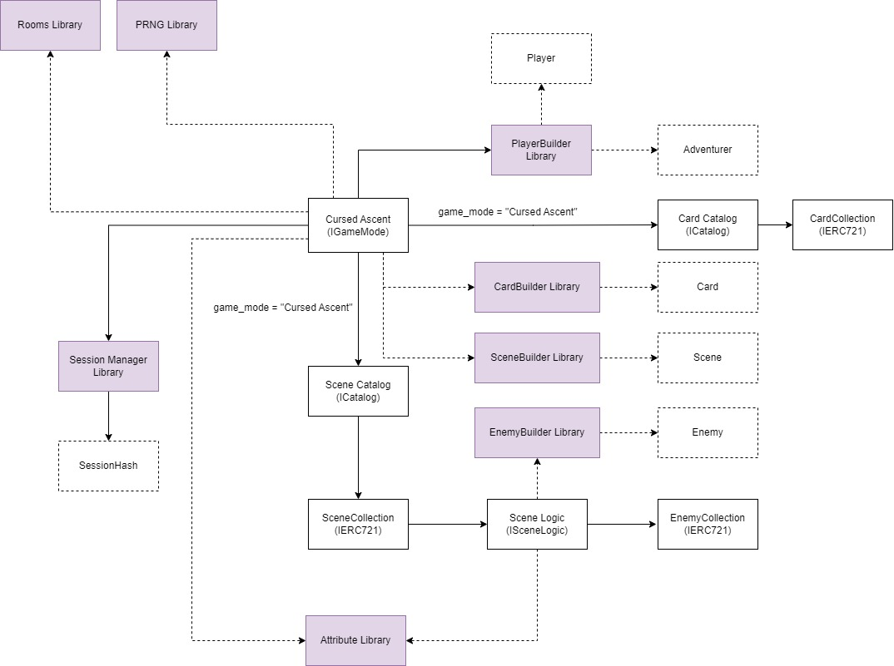

# The concept behind Cursed Ascent

### What is Cursed Ascent?

Cursed Ascent is a roguelite deckbuilding game. You must ascend through dangerous spires and defeat the boss at its top to win.
A spire is composed of several rooms, with various enemies, and other mysterious encounters...

You start with a standard card deck with different powers (attack, protection, ...). You will use these cards to defeat your opponents during your ascension. Completing a room's challenge may grant you a reward, generally a new card to increment your deck and build strong card strategies.

Manage your health points with attention or you may fall in the spire!

### Integration with BibliothecaDAO's Adventurer module

The player in Cursed Ascent is based on the [BibliothecaDAO's Adventurer module](https://scroll.bibliothecadao.xyz/docs/category/%EF%B8%8F-adventurers). The statistics and the Loot equipments are interpreted in our game to scale up or down the cards played. Plus, the Loot weapon equiped define the base Class use for a game session. Thus we have 4 classes based on the [Loot lore](https://docs.loot.foundation/canonical-principles/loot/loot-classification-and-ratings-system/character-classes-specialties/character-classes-mages-hunters-warriors):

- the Warrior (bludgeon weapons)
- the Hunter (blade weapons)
- the Light Mage (book weapons)
- the Dark Mage (wand weapons)

### The Open Contract Architecture

We designed a contract architecture that allows anyone to build on top of our system. Take a look at this diagram:

- Cards are NFTs stored in a **CardCollection** contract. It implements additional on-chain data like the effects of a card, or its rarity. On top of that, the metadata provides adaptable descriptions, so any interface can retrieve it and changes the dynamic values (for example, an Attack card will deal more damages if the player has more strength). The Cursed Ascent SDK will provide helper functions to implement this logic.
- Enemies are also NFTs, stored in an **EnemyCollection**. it works the same as CardCollection.
- Scenes are the description of an encounter in the spire. They are stored as NFT in a **SceneCollection**, and each token is linked to its own **SceneLogic** contract. This allows the GameMode to execute personalized logics and create unique encounters.
- Cards and Scenes are compiled in their respective **Catalog**. This way, a GameMode can registers all the collections it will use to implement its game logic. Plus, it provides a decentralized & public way to retrieve all data related to a GameMode.
  Enemies are retrieved by SceneLogic contracts.
- The **GameMode** contract is the only main entrypoint for application to interact with the game. It implements its own saving system, room handling, player instanciation and deck management. For all these tasks we implemented:
  - a **SessionManager** library, to save on-chain the hash of the game state for any player (game state are stored off-chain by the user, and is passed as parameter on every transaction).
  - a **Rooms** library, that generates and packs the map layout in felts (number of rooms & floor, and connections between them).
  - a **PRNG** library, based on [Realm Xoroshiro128\*\* implementation](https://github.com/BibliothecaForAdventurers/realms-contracts/blob/main/contracts/utils/xoroshiro128_starstar.cairo).
  - a **PlayerBuilder** library that instanciate the player statistics and base deck according to its Adventurer NFT.
- Finally, we implements a **CardBuilder**, a **EnemyBuilder**, and a **SceneBuilder** library to easily retrieve data between contracts.
